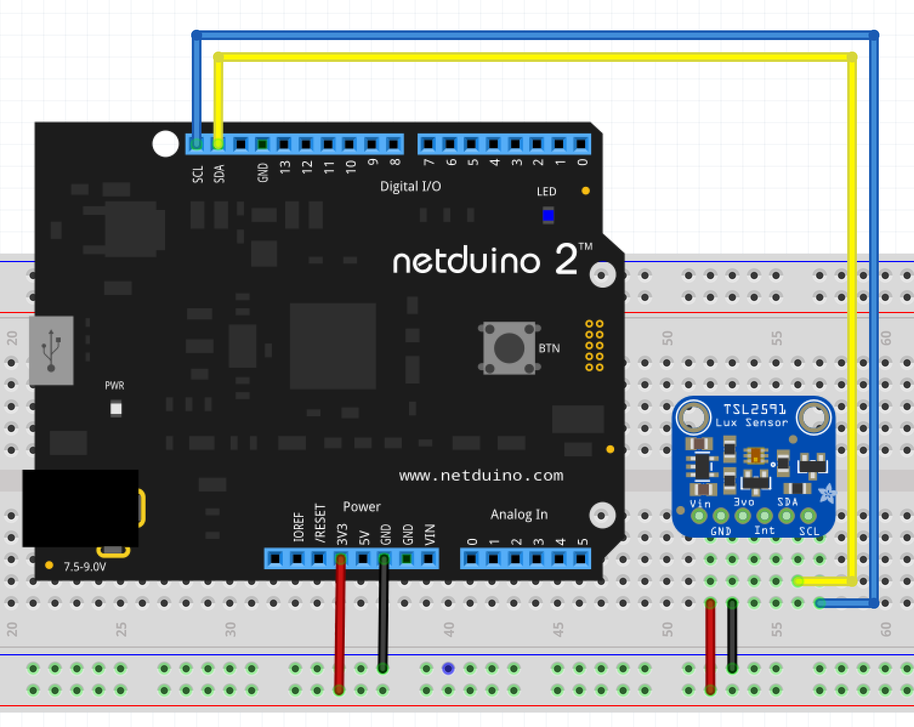

# TSL2561 Light Sensor

The TSL2561 is alight sensor that is compensated for the presence of infrared light.  This compensation allows for the reading to be closer to that experienced by the human eye.

An interrupt pin allows the sensor to generate an interrupt if the sensor reading goes below a lower threshold or exceeds an upper threshold.

The sensor is controlled and data read over the I2C bus.

## Purchasing

The TSL2561 is available as a breakout board from the following suppliers:

* [Adafruit](https://www.adafruit.com/product/439)
* [Sparkfun](https://www.sparkfun.com/products/12055)

## Hardware

The basic configuration of the TSL2561 requires only the data and power connections to be made:

## Software

To be completed

# API

To be completed