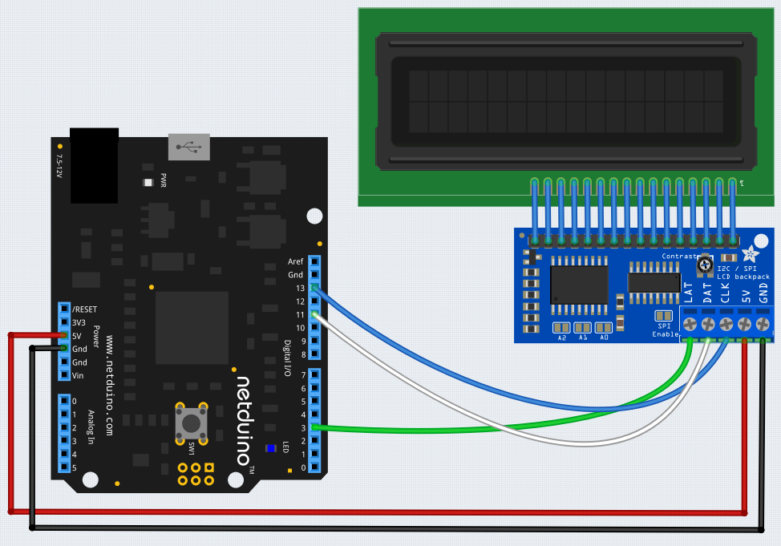

# Micro Liquid Crystal Display

The μLiquidCrystal is .NET Micro Framework library for popular LCD displays with HD44780 compatible controller.

This library originally appeared on Codeplex (retired 2017).  The original notes and licence agreement can be found [here](licence.md).

## Purchasing

LCD displays are available from a number of suppliers including [Adafruit](https://www.adafruit.com) and [Sparkfun](https://www.sparkfun.com).  The example blow uses a standard 16x2 LCD fitted with the [I2C / SPI backpack](https://www.adafruit.com/product/292).

## Hardware

The `MicroLiquidCrystal` library can be connected to the [Adafruit I2C / SPI backpack](https://www.adafruit.com/product/292) as follows:



## Software

The following application illustrates how to display text on the LCD.  The first line of text is static while the lower line is updated:

```csharp
using System.Threading;
using Microsoft.SPOT.Hardware;
using Netduino.Foundation.Displays.MicroLiquidCrystal;
using SecretLabs.NETMF.Hardware.NetduinoPlus;

namespace MicroLiquidCrystal595Test
{
    public class Program
    {
        public static void Main()
        {
            var setup = new BaseShifterLcdTransferProvider.ShifterSetup
            {
                BL = ShifterPin.GP7,
                RS = ShifterPin.GP1,
                RW = ShifterPin.None,
                Enable = ShifterPin.GP2,
                D4 = ShifterPin.GP6,
                D5 = ShifterPin.GP5,
                D6 = ShifterPin.GP4,
                D7 = ShifterPin.GP3
            };
            var lcdBus = new Shifter74Hc595LcdTransferProvider(SPI.SPI_module.SPI1,
                Pins.GPIO_PIN_D3,
                Shifter74Hc595LcdTransferProvider.BitOrder.MSBFirst,
                setup);
            var lcd = new Lcd(lcdBus);
            lcd.Begin(16, 2);
            lcd.Write("Hello, world!");
            while (true)
            {
                lcd.SetCursorPosition(0, 1);
                lcd.Write((Utility.GetMachineTime().Ticks / 10000).ToString());
                Thread.Sleep(100);
            }
        }
    }
}
```

## API

### Enum

#### `ShifterPin`

The `ShifterPin` enum allows the assignment of the LCD pins on the display to specific output pins on the GPIO IC (74595 etc.).

### Classes and Structures

#### `ShifterSetup` (member of the `BaseShifterLcdTransferProvider` class)

The members of the `ShifterSetup` class allow the mapping of the functions on the LCD display pins to shift register pins.

`D4`, `D5`, `D6` and `D7` map to the four data pins connected to the LCD interface.

`BL` maps to the backlight pin on the LCD interface.

`RS` (Register Select) maps to the command or data selection pin on the LCD interface.

`RW` Read-write selection pin.

`Enable` line on the LCD interface.

### Properties

#### `bool ShowCursor`

Turn the cursor on (`true`) or off (`false`).

#### `bool BlinkCursor`

Display a blinking cursor (`true`) or static cursor(`false`).

#### `bool Visible`

Make the contents of the LCD visible (`true`) or turn the display off (`false`).  Make this display contents visible restores the previous contents and cursor conditions.

#### `bool Backlight`

Turn the backlight on (`true`) or off (`false`).

#### `Encoding Encoding`

Encoding used for the characters on the display.  the default encoding is `UTF8`.

### Constructors

#### `Lcd(ILcdTransferProvider provider)`

Create a new `Lcd` object configured to use the specified transfer provider.

### Methods

#### `Begin(columns, lines)`

Setup the display with the specified number of `columns` and `lines`.  By default the text will scroll from left to right when scrolling is enabled.

For one line displays, the font height will be set to standard height.

#### `void Begin(byte columns, byte lines, bool leftToRight, bool dotSize)`

Setup the display with the specified number of `columns` and `lines`.

When scrolling is enabled, the text will scroll left to right when `leftToRight` is `true` or right to left when `leftToRight` is `false`.

For single line displays it is possible (where supported) to use a 10 pixel heigh font.  This is indicated by the `dotSize` parameter.

#### `void Clear()`

Clear the contents of the display.

#### `void Home()`

Move the cursor to the upper left corner of the LCD.

#### `void SetCursorPosition(column, line)`

Move the cursor to the specified `column` and `row`.  Note that both of these values are 0 indexed.

#### `void ScrollDisplayLeft()` and `void ScrollDisplayRight()`

Scroll the display one position to the left or right.

#### `void MoveCursor(bool right)`

Move the cursor one position left (when `right` is `false`) or right.

#### `void Write(string text)`

Convert the string using the preset encoding (see the `Encoding` property) to s stream of characters and send the characters to the LCD display.

#### `void Write(byte[] buffer, int offset, int count)`

Write a `count` bytes from the `buffer` to the LCD display starting at the specified `index`.

#### `void WriteByte(byte data)`

Write a single byte to the display at the current cursor position.

#### `void SendCommand(byte command)`

Send the specified `command` byte to the LCD display.

#### `void CreateChar(int location, byte[] charmap, int offset)`

Create a customs character at `location` in the custom character buffer.  `location` should be in the range 0-7.

The pixel data is stored in the `charmap` at the specified `offset`.

#### `void CreateChar(int location, byte[] charmap)`

Create a customs character at `location` in the custom character buffer.  `location` should be in the range 0-7.

The pixel data is stored in the `charmap`.