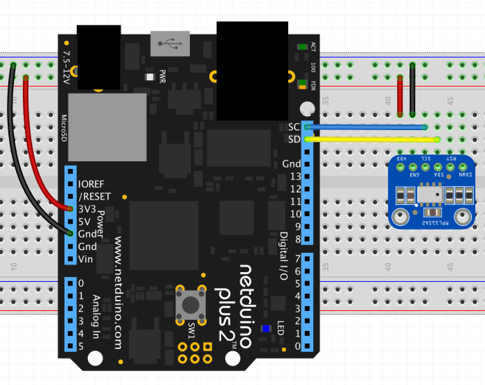

# MPL115A2 - Pressure and Temperature Sensor

The MPL115A2 is a low cost device for reading barometric pressure.

* I2C digital interface (address: `0x60`)
* Resolution: 1.5 hPa
* Range: 100-1150 hPa up to 10Km

## Purchasing

The MPL115A2 sensor is available on a breakout board from Adafruit

* [Adafruit MPL115A2 Breakout Doard](https://www.adafruit.com/product/992)

## Hardware

The simplest method of connecting the MPL115A2 to the Netduino requires only four connections:



In this diagram, the shutdown (`SDWN`) and reset (`RST`) pins have been left floating.  Both of these pins are active low and can be tied to V<sub>cc</sub> in normal operation.

Note that the Adafruit breakout board has `10K` pull-up resistors on teh `SDA` and `SCK` lines.

## Software

The following application reads the temperature and pressure from the MPL115A2 every second and displays the readings in the `Debug` output:

```csharp
using System.Threading;
using Microsoft.SPOT;
using Netduino.Foundation.Sensors.Barometric;

namespace MPL115A2Test
{
    public class Program
    {
        public static void Main()
        {
            var mpl115a2 = new MPL115A2();

            Debug.Print("MPL115A2 Test");
            while (true)
            {
                mpl115a2.Read();
                Debug.Print("Pressure: " + mpl115a2.Pressure.ToString("f2") + " kPa, Temperature: " + mpl115a2.Temperature.ToString("f2") + "C");
                Thread.Sleep(1000);
            }
        }
    }
}
```

## API

This API supports a polled method of reading the sensor.  The `Read` method forces the sensor to take new readings and then record the readings in the `Temperature` and `Pressure` properties.

### Constructor

#### `MPL115A2(byte address = 0x60, ushort speed = 100)`

Create a new MPL115A2 object.

### Properties

#### `Pressure`

Return the pressure reading returned by the last call to the `Read` method.

This value is recorded in kPa.

#### `Temperature`

Return the temperature reading returned by the last call to the `Read` method.

This value is recorded in degrees C.

### Methods

#### `Read()`

Force the sensor to take a reading and record the readings in the `Pressure` and `Temperature` properties.