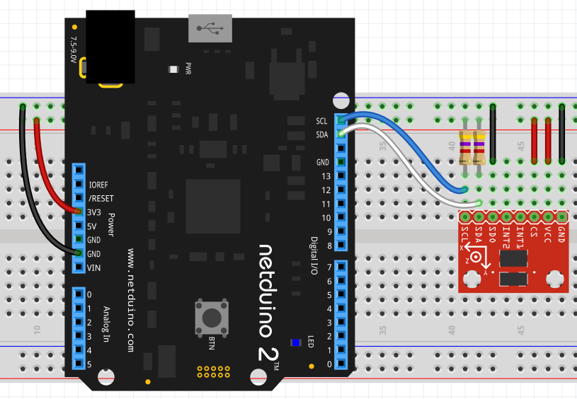

# ADXL345 - Triple Axis Accelerometer

Summary

## Hardware

This diagram shows how to connect the ADXL345 to the Netduino when interrupts are not required.

The `SDA` and `SCL` lines both require pull-up resistors (4.7k&Omega;) when they are not present on the breakout board.

If interrupts are used then the `Int1` and `Int2` pins should be connected to the Netduino using the digital pins.  The relevant pin(s) should then be configured as an `InterruptPort`.

## Software

Small sample application demonstrating using the sensor.

## API

Describe the API.

### Constants

#### Constant 1

### Enums

#### Enum 1

### Constructors

#### Constructor 1

### Properties

#### Property 1

### Methods

#### Method 1