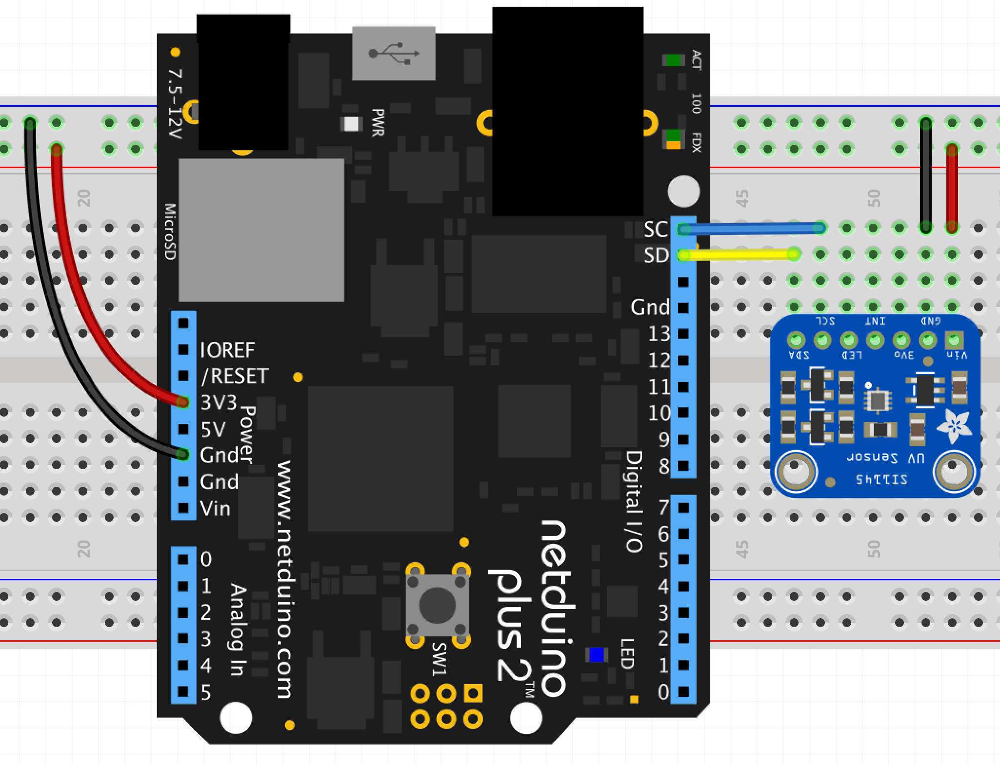

# SI1145 - Proximity / Ultraviolet / Ambient Light Sensor

The SI1145  is a low power infrared, ultraviolet and ambient light sensor with an I2C interface.

* Ultraviolet / Infrared / ambient light sensor
* Proximity sensor
* Independent LED drivers
* I2C interface up to 3.4 MBps

## Purchasing

* [SI1145 from Adafruit](https://www.adafruit.com/product/1777)

## Hardware

## Software

## API

### Constructors

### Properties

### Methods
