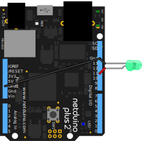

# Info

Represents an LED whose voltage is limited by the duty-cycle of a PWM signal.

# Example

The following example alternates between blinking and pulsing an LED:

## Code

```csharp
using N = SecretLabs.NETMF.Hardware.Netduino;
using System.Threading;

namespace Netduino.Foundation.Core.Samples
{
    public class PwmLed_BlinkAndPulseProgram
    {
        public static void Main()
        {
            // create a new pwm controlled LED on pin 11
            var pwmLed = new LEDs.PwmLed(N.PWMChannels.PWM_PIN_D11, 
                LEDs.TypicalForwardVoltage.Green);

            // alternate between blinking and pulsing the LED 
            while (true)
            {
                pwmLed.StartBlink();
                Thread.Sleep(5000); // 5 seconds

                pwmLed.StartPulse(lowBrightness: 0.2F);
                Thread.Sleep(10000); // 10 seconds
            }
        }
    }
}
```

## Circuit



# API Reference

## Constructors

#### `public PwmLed(H.Cpu.PWMChannel pin, float forwardVoltage)`

Creates a new PwmLed on the specified PWM pin and limited to the appropriate  voltage based on the passed `forwardVoltage`. Typical LED forward voltages can be found in the [`TypicalForwardVoltage`](../TypicalForwardVoltage/) class.

## Properties

#### `public float Brightness { get; set; }`

The brightness of the LED, controlled by a PWM signal, and limited by the calculated maximum voltage. Valid values are from 0 to 1, inclusive.

Therefore, specifying `0.5` would set the LED to 50% brightness.

## Methods

#### `public void StartBlink(int onDuration = 200, int offDuration = 200, float highBrightness = 1, float lowBrightness = 0)`

Start the Blink animation which sets the brightness of the LED alternating between a low and high brightness setting, using the durations provided.

#### `public void StartPulse(int pulseDuration = 600, float highBrightness = 1, float lowBrightness = 0.15F)`

Start the Pulse animation which gradually alternates the brightness of the LED between a low and high brightness setting, using the durations provided.

### `public void Stop()`

Stops any running animations.