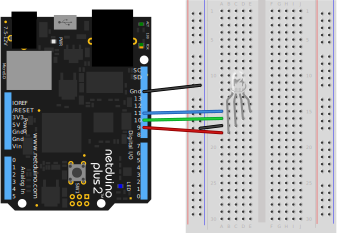

# Info

Represents an RGB LED whose color is controlled by the duty-cycle of three PWM signals. Can be used both with LEDs that have been current limited with in-series resistors, or LEDs without resistors. 

Controlling an RGB LED via a PWM signal is more power efficient than using a current-limiting resistor, and it provides more control; allowing thousands of different colors, as opposed to the 8 colors of non-PWM powered RGB LED.

To use without resistors, pass in the forward voltages (voltage drop) of each of the LED components to the `redLedForwardVotlage`, `greenLedForwardVotlage`, and `blueLedForwardVotlage`, constructor parameters, and the class will limit its output to the maximum forward voltage rating for those LEDs.

To use with an LED that has a resistor in series, pass `0.0` or `TypicalForwardVoltage.ResistorLimited` to the forward voltage parameters.


## Examples

### Displaying the Rainbow of Hues

The following example code loops through the entire 360º of hue spectrum and displays that color on the RGB LED.

#### Code

```csharp
using Microsoft.SPOT;
using N = SecretLabs.NETMF.Hardware.Netduino;
using System.Threading;

namespace Netduino.Foundation.Core.Samples
{
    public class Program
    {
        public static void Main()
        {
            // create a new pwm controlled RGB LED on pins Red = 9, Green = 10, 
            // and Blue = 11.
            var rgbPwmLed = new Netduino.Foundation.LEDs.RgbPwmLed(
              N.PWMChannels.PWM_PIN_D9, N.PWMChannels.PWM_PIN_D10,
              N.PWMChannels.PWM_PIN_D11);

            // run forever
            while (true)
            {

                // loop through the entire hue spectrum (360 degrees)
                for (int i = 0; i < 360; i++)
                {
                    var hue = ((double)i / 360F);
                    Debug.Print(hue.ToString());

                    // set the color of the RGB
                    rgbPwmLed.SetColor(Color.FromHsba(((double)i/360F), 1, 1));

                    // for a fun, fast rotation through the hue spectrum:
                    //Thread.Sleep (1);
                    // for a gentle walk through the forest of colors;
                    Thread.Sleep(18);
                }
            }
        }
    }
}
```

#### Circuit

Note that this circuit uses resistors in series with the three components of the RGB LED:


To use without the resistors, pass the forward voltage of each LED to the constructor, as in the next example.

### Blinking, Pulsing and Animating through Colors with an RGB LED

The following code blinks and pulses the RGB LED. In this example, no resistors are needed, as the forward voltage of each the the three LED components (R = `2.1V`, G = `3.0V`, B = `3.0V`) are passed to the constructor.

#### Code

```csharp
using System.Threading;
using N = SecretLabs.NETMF.Hardware.Netduino;

namespace Netduino.Foundation.Core.Samples
{
    public class RgbPwmLed_BlikAndPulseProgram
    {
        public static void Main()
        {
            // create a new pwm controlled RGB LED on pins Red = 9, Green = 10, 
            // and Blue = 11.

			  // 
            var rgbPwmLed = new LEDs.RgbPwmLed(N.PWMChannels.PWM_PIN_D9, 
             N.PWMChannels.PWM_PIN_D10, N.PWMChannels.PWM_PIN_D11, 
             2.1F, 3.0F, 3.0F);

            // run forever
            while (true)
            {
                // blink for 5 seconds
                rgbPwmLed.StartBlink(Color.AliceBlue);
                Thread.Sleep(5000);

                // pulse
                rgbPwmLed.StartPulse(Color.Orange);
                Thread.Sleep(5000);

                // alternate between two colors for 10 seconds
                rgbPwmLed.StartAlternatingColors(Color.Bisque, Color.Purple, 200, 200);
                Thread.Sleep(10000);

                // run through various colors for 10 seconds
                rgbPwmLed.StartRunningColors(new System.Collections.ArrayList { Color.White, Color.YellowGreen, Color.Tomato, Color.SteelBlue } , new int []{ 250, 150, 100, 200 });
                Thread.Sleep(10000);
            }

        }
    }
}

```

### Circuit




# API

## Constructors

#### `public RgbPwmLed(PWMChannel redPin, PWMChannel greenPin, PWMChannel bluePin, float redLedForwardVoltage = TypicalForwardVoltage.ResistorLimited, float greenLedForwardVoltage = TypicalForwardVoltage.ResistorLimited, float blueLedForwardVoltage = TypicalForwardVoltage.ResistorLimited, bool isCommonCathode = true)`

Creates a new RgbPwmLed on the specified PWM pins and limited to the appropriate voltages based on the passed `forwardVoltage` parameters. Typical LED forward voltages can be found in the [`TypicalForwardVoltage`](../TypicalForwardVoltage/) class.

## Properties

#### `public bool IsCommonCathode { get; protected set; }`

Note: this is unimplemented.

#### `public H.Cpu.PWMChannel RedPin { get; protected set; }`

Returns the PWM Channel for the Red LED component.

#### `public H.Cpu.PWMChannel GreenPin { get; protected set; }`

Returns the PWM Channel for the Green LED component.

#### `public H.Cpu.PWMChannel BluePin { get; protected set; }`

Returns the PWM Channel for the Blue LED component.

#### `public float RedForwardVoltage { get; protected set; }`

Returns the voltage drop of the Red LED component.

#### `public float GreenForwardVoltage { get; protected set; }`

Returns the voltage drop of the Gren LED component.

#### `public float BlueForwardVoltage { get; protected set; }`

Returns the voltage drop of the Blue LED component.

#### `public Color Color { get; }`

Returns the current [`Color`](/API/Color/) that the LED is set to.

## Methods

#### `public void SetColor(Color color)`

Sets the current color of the LED.

#### `StartRunningColors(System.Collections.ArrayList colors, int[] durations, bool loop = true)`

Animates through the listed colors for the specified durations. To use the same duration for all colors,  pass in an array with a length of 1 for `durations`.

Will loop forever, unless the `loop` parameter is passed `false`.

#### `public void StartBlink(Color color, int highDuration = 200, int lowDuration = 200, float highBrightness = 1, float lowBrightness = 0)`

Start the Blink animation which sets the brightness of the LED alternating between a low and high brightness setting, using the durations provided.

#### `public void StartPulse(Color color, int pulseDuration = 600, float highBrightness = 1, float lowBrightness = 0.15F)`

Start the Pulse animation which gradually alternates the brightness of the LED between a low and high brightness setting, using the durations provided.

#### `public void Stop()`

Stops any running animations.