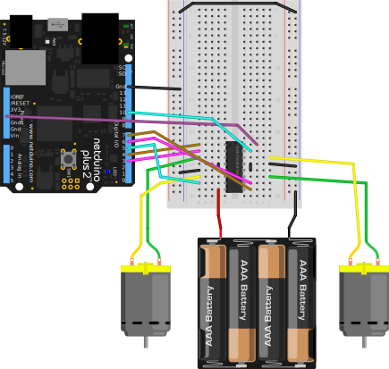

# Info

An [h-bridge](https://www.wikiwand.com/en/H_bridge) motor controller enables a control signal to drive a much larger load in either polarity, allowing the Netduino to drive DC motors in forward or reverse from an external power supply. Using [pulse-width-modulation (PWM)](http://developer.wildernesslabs.co/Netduino/Input_Output/Digital/PWM/) as the control signal, provides not just forward or reverse control, but variable speeds in either direction.


## Sourcing

This generic driver works with standard h-bridges ICs such as the Texas Instruments [L2N93E](https://octopart.com/search?q=L293NE) or [SN754410](https://octopart.com/search?q=SN754410) chips.

It should also work with heavier duty [L298N](https://www.amazon.com/s/ref=nb_sb_noss_2?url=search-alias%3Daps&field-keywords=l298n) drivers. 

# Example

The following example uses a dual h-bridge chip to control two motors. Both the L293NE and NS754410 are dual h-bridge chips that can drive two motors in both forward and reverse. This is a common configuration for wheeled robots. Forward and reverse motion is obtained by setting both the motors to have the same forward or reverse speed, and turning is accomplished by setting them to different speeds.

## Sample Circuit

Though h-bridge motor controllers come in various form factors, they typically share the following pins and usages:

| Motor Controller Pin           | Description                                           |
|--------------------------------|-------------------------------------------------------|
| **1,2EN** or **ENABLE A**      | Motor 1 enable. This should be configured as `enablePin` in the constructor, and it controls whether or not the motor is powered. The `HBridgeMotor` driver will automatically set this to high (enabled) when the speed is not zero. This is also enabled when `IsNeutral` is set to false, as powering the motor will cause it to brake when the speed is set to `0`. <br/><br/> On the L2N93E and SN754410 chips, this is labeled as **1,2EN**, and on the L298N, it's typically labeled as **ENABLE A**. |
| **3,4EN** or **ENABLE B**             | Motor 2 enable pin. If you are driving two motors, you'll need two `HBridgeMotor` objects, as shown in the example below. |
| **[1,2]A** or **INPUT [1,2]**  | Motor 1 control inputs. These are configured as the `a1Pin` and `a2pin` constructor parameter. These are the low-voltage control signals for motor 1 forward and reverse. <br/><br/> On the L2N93E and SN754410 chips, this is labeled as **1A** and **2A**, and on the L298N chip, it's typically labeled as **INPUT 1** and **INPUT 2**. |
| **[3,4]A** or **INPUT [3,4]**   | Motor 2 control inputs.                              |
| **GROUND** or **GND**           | Common/ground. Both the motor power supply and the logic power supply should be tied together on the same common ground plane. |
| **V<sub>CC2</sub>**, **+12V**, or **V<sub>s</sub>** | This is the positive voltage supply that drives the motors. Depending on the chip used, this may be anywhere from `4.5V` up to `50V`. |
| **V<sub>CC1</sub>**, **+5V**, or **V<sub>SS</sub>** | This is the logic voltage supply that powers the chip logic. This should be tied into the `5V` voltage pin on the netduino.    |

The following breadboard diagram illustrates connecting two motors to an h-bridge chip that uses a external power supply to drive the motors:



## Code

The following code creates an h-bridge controller with the PWM controllers on pins 3 and 5, and the enable pin on pin 4. It then sets the motor speed to 100% forward, stops the motor for half a second, and then sets the motor speed to 100% reverse. 

```csharp
using System.Threading;
using H = Microsoft.SPOT.Hardware;
using N = SecretLabs.NETMF.Hardware.Netduino;
using Netduino.Foundation.Motors;

namespace HBridgeMotor_Sample
{
    public class Program
    {
        public static void Main()
        {
            var motor1 = new HBridgeMotor(N.PWMChannels.PWM_PIN_D3, N.PWMChannels.PWM_PIN_D5, N.Pins.GPIO_PIN_D4);
            var motor2 = new HBridgeMotor(N.PWMChannels.PWM_PIN_D6, N.PWMChannels.PWM_PIN_D10, N.Pins.GPIO_PIN_D7);

            while (true)
            {
                // set the speed on both motors to 100% forward
                motor1.Speed = 1f;
                motor2.Speed = 1f;
                Thread.Sleep(1000);
                motor1.Speed = 0f;
                motor2.Speed = 0f;
                Thread.Sleep(500);
                // 100% reverse
                motor1.Speed = -1f;
                motor2.Speed = -1f;
                Thread.Sleep(1000);
            }
        }
    }
}
```

# API

## Properties

#### `float IsNeutral { get; set; }`

Whether or not the motor connected to the h-bridge is not enabled. If `IsNeutral` is `true`, then the motor controller is disabled and rotor spins freely. If `IsNeutral` is false, then the motor will be energized and the rotor will be "locked" into position. 

#### `public float MotorCalibrationMultiplier { get; set; } = 1;`


#### `float Speed { get; set; }`

The speed, represented by a value from `-1` to `1` of the motor. `-1` means 100% reverse, and `1` means 100% forward. 


## Constructors

#### `public HBridgeMotor(H.Cpu.PWMChannel a1Pin, H.Cpu.PWMChannel a2Pin, H.Cpu.Pin enablePin)`

Instantiates a new `HBridgeMotor` on the specified pins. 

##### Parameters

 * `a1Pin` - The PWM channel pin that creates the forward rotation signal.
 * `a2Pin` - The PWM channel pin that creates the reverse rotation signal.
 * `enablePin` - A digital IO pin that enables and disables the h-bridge, which controls `IsNeutral`.