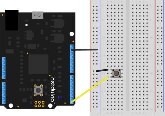

# Info

The PushButton class represents a simple push button, such as a tactile momentary button. To get notified when it's clicked, subscribe to the `Clicked` event. If you need to know when the button is held down, subscribe to the `PressStarted` and `PressEnded` events.

# Sourcing

One of the most common push buttons are momentary tactile buttons and come in an array of sizes. Most commonly they have 4 leads, two of which are redundant and provide stability and mounting strength when soldered to a PCB, but some have only two leads.

* [Tactile Buttons on Amazon](https://www.amazon.com/s/ref=nb_sb_noss_1?url=search-alias%3Delectronics&field-keywords=tactile+button)
* [Tactile Buttons on Adafruit](https://www.adafruit.com/product/367)
* [Colored Tactile Buttons on SparkFun](https://www.sparkfun.com/products/10302)

# Sample Circuit

The following circuit illustrates a push button wired in `CircuitTerminationType.CommonGround` configuration on digital pin `0`:

# API

## Properties

#### `public TimeSpan DebounceDuration { get; set; }`

This duration controls the debounce filter. It also has the effect of rate limiting clicks. Decrease this time to allow users to click more quickly.

Default time is 20 milliseconds, which should be good for most tactile push buttons.

#### `public H.InterruptPort DigitalIn { get; private set; }`

Returns the interrupt port that the pushbutton is configured on.

## Events

#### `public event EventHandler PressStarted`

Raised when a press starts (the button is pushed down).

#### `public event EventHandler PressEnded`

Raised when a press ends (the button is released).

#### `public event EventHandler Clicked`

Raised on a click (the button is pressed and released).

## Constructors

#### `public PushButton(H.Cpu.Pin inputPin, CircuitTerminationType type, int debounceDuration = 20)`

Instantiates a new `PushButton` on the specified `inputPin`, with the specified [`CircuitTerminationType'](/API/CircuitTerminationType), and optionally, a specified debounce duration.