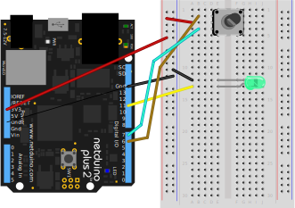

# Info

Rotary encoders are similar in form factor to potentiometers, but instead of modifying a voltage output, they send a digital signal encoded using [Gray Code](https://en.wikipedia.org/wiki/Gray_code) when rotated that can be decoded to ascertain the direction of turn. 


Rotary encoders have several advantages over potentiometers as input devices, namely:

 * They're more power efficient; they only use power when actuated.
 * They're not rotation-bound; they spin infinitely in either direction.
 * Many rotary encoders also have a built-in pushbutton.

Rotary encoders are used almost exclusively on things like volume knobs on stereos.

And because they're not rotation bound, they are especially useful in the case in which a device might have multiple inputs to control the same parameter. For instance, a stereo's volume might be controlled via a knob and a remote control. If a potentiometer were used for the volume knob, then the actual volume could get out of synch with the apparent value on the potentiometer when the volume was changed via the remote.

For this reason, rotary encoders are particularly useful in connected things, in which parameters might be controlled remotely.

## Two-bit Gray Code

This rotary encoder driver works with most rotary encoders which return a two-bit [Gray Code](https://en.wikipedia.org/wiki/Gray_code) which is the minimum number of bits necessary to describe direction. Most common rotary encoders use two-bit Gray Code, so this driver should work with most common rotary encoders.  

# LED Dimmer Example

The following example uses a rotary encoder to adjust the brightness of a [`PwmLed`](/API/LEDs/PwmLed/).

## Circuit

Note, depending on your encoder, it may have a common/ground (`gnd`) or (`-`) leg in addition to the positive (`+`) leg. If it does, make sure to wire it to ground.

The a-phase pin may be labeled (`A`), (`CLK`) or other. If the `Rotated` event is indicating the wrong direction, simply switch the a-phase and b-phase pins.



## Code

```csharp
using System.Threading;
using Microsoft.SPOT;
using N = SecretLabs.NETMF.Hardware.Netduino;
using Netduino.Foundation.Sensors.Rotary;
using Netduino.Foundation.LEDs;

namespace Netduino.Foundation.Core.Samples
{
    /// <summary>
    /// Illustrates changing the brightness of an LED in response to the 
    /// rotation of a rotary encoder. Rotating the encoder to the right 
    /// turns the LED up, and rotating the encoder to the left, turns the 
    /// LED down.
    /// </summary>
    public class RotaryEncoderSample
    {

        public static void Main()
        {
            // instantiate an app singleton and set it to run.
            App app = new App();
            app.Run();
     
            Thread.Sleep(Timeout.Infinite);
        }
    }

    /// <summary>
    /// This sample uses the App singleton pattern which is better than 
    /// stuffing everything into the static void main because it allows 
    /// you to use instance members and whatnot and is much more conducive 
    /// to organizing complex logic.
    /// </summary>
    public class App
    {
        protected RotaryEncoder _rotary = null;
        protected PwmLed _led = null;
        // how much to change the brightness per rotation step. 
        // 0.05 = 20 clicks to 100%
        protected float _brightnessStepChange = 0.05F; 

        public App()
        {
            // instantiate our peripherals
            this._rotary = new RotaryEncoder(N.Pins.GPIO_PIN_D6, 
               N.Pins.GPIO_PIN_D7);
            this._led = new PwmLed(N.PWMChannels.PWM_PIN_D11, 
               TypicalForwardVoltage.Green);
        }

        public void Run()
        {
            // wire up events
            this._rotary.Rotated += Rotary_Rotated;
        }

        protected void Rotary_Rotated(object sender, RotaryTurnedEventArgs e)
        {
            // if clockwise, turn it up! clamp to 1, so we don't go over.
            if (e.Direction == RotationDirection.Clockwise)
            {
                if(this._led.Brightness >= 1) {
                    return;
                } else {
                    this._led.SetBrightness( (this._led.Brightness + 
                        _brightnessStepChange).Clamp(0,1) );
                }
            } 
            else // otherwise, turn it down. clamp to 0 so we don't go below. 
            { 
                if (this._led.Brightness <= 0) {
                    return;
                } else {
                    this._led.SetBrightness( (this._led.Brightness - 
                        _brightnessStepChange).Clamp(0,1) );
                }
            }
        }
    }
}
```

# API

## Events

### `RotaryTurnedEventHandler Rotated`

Raised when the rotary encoder is rotated and returns a [`RotaryTurnedEventArgs`](/API/Sensors/Rotary/RotaryTurnedEventArgs) object which describes the direction of rotation.

## Properties

#### `H.InterruptPort APhasePin { get; }`

Returns the pin connected to the A-phase output on the rotary encoder.

#### `H.InterruptPort BPhasePin { get; }`

Returns the pin connected to the B-phase output on the rotary encoder.

## Constructors

#### `public RotaryEncoder(H.Cpu.Pin aPhasePin, H.Cpu.Pin bPhasePin)`

Instantiates a new RotaryEncoder on the specified pins. 


