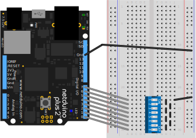

# Info

Represents a DIP-switch wired in a bus configuration, in which all switches are terminated to the same ground/common or high pin.

 * **Note: This component is untested.**


# Example

## Code

```csharp
using System.Threading;
using Microsoft.SPOT;
using H = Microsoft.SPOT.Hardware;
using N = SecretLabs.NETMF.Hardware.Netduino;
using Netduino.Foundation.Sensors.Switches;

namespace Netduino.Foundation.Core.Samples
{
    public class Program
    {
        public static void Main()
        {
            var dipSwitch = new DipSwitch(new H.Cpu.Pin[] {
                N.Pins.GPIO_PIN_D0, N.Pins.GPIO_PIN_D1, 
                N.Pins.GPIO_PIN_D2, N.Pins.GPIO_PIN_D3,
                N.Pins.GPIO_PIN_D4, N.Pins.GPIO_PIN_D5, 
                N.Pins.GPIO_PIN_D6, N.Pins.GPIO_PIN_D7 },
                CircuitTerminationType.CommonGround);

            dipSwitch.Changed += (object s, ArrayEventArgs e) =>
            {
                Debug.Print("Switch " + e.ItemIndex + " changed to " 
                    + (((ISwitch)e.Item).IsOn ? "on" : "off"));
            };

            Thread.Sleep(Timeout.Infinite);
        }
    }
}
```

## Circuit



# API

## Events

#### `public event ArrayEventHandler Changed`

Raised when one of the switches is switched on or off.


## Properties

#### `public ISwitch this[int i]` (Indexer)

Returns the `ISwitch` at the specified index.

## Constructors

#### `public DipSwitch(H.Cpu.Pin[] switchPins, CircuitTerminationType type)`

Creates a new `DipSwitch` connected to the specified `switchPins`, with the [`CircuitTerminationType`](/API/CircuitTerminationType) specified by the `type` parameters.

