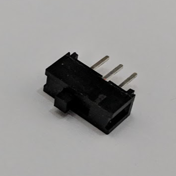

# Info

Represents a simple, two position, Single-Pole-Dual-Throw (SPDT) switch that closes a circut to either ground/common or high depending on position.

# API

## Events

#### `public event EventHandler Changed`

Raised when the switch circuit is opened or closed.

## Properties

#### `public bool IsOn`

Describes whether or not the switch circuit is closed/connected (`IsOn = true`), or open (`IsOn = false`).

## Constructors

#### `public SpstSwitch(H.Cpu.Pin pin)`

Instantiates a new `SpdtSwitch` object with the center pin connected to the specified digital `pin`, one pin connected to common/ground and one pin connected to high/3.3V.