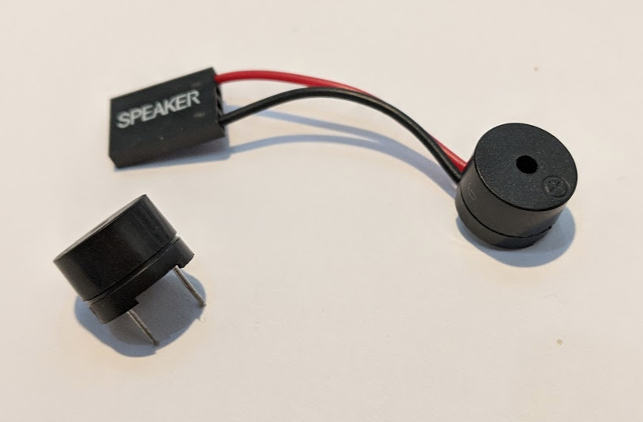

# Info

The PiezoSpeaker class represents a simple piezo speaker that can be used to generate tones across a range of frequencies. They typically perform well between 1-5kHz but may go as high as 100kHz. Implements [IToneGenerator](../IToneGenerator).

# API

## Constructors

#### `public PiezoSpeaker(H.Cpu.PWMChannel pwmChannel)`

Instantiates a new `PiezoSpeaker` on the specified `PWMChannel.

## Public Methods

#### `public void PlayTone(float frequency. int duration = 0)`

Use the `PlayTone` method to play a tone at a specific frequency. Optionally set the `duration` property to specify the length of time the tone is played in milliseconds.

If a duration is specified, the call to `PlayTone` will block until the tone is finished.

If a `duration` of 0 is set, a tone will start playing and the method will return. The tone will continue to play until `StopTone` is called.

#### public void `StopTone()`

If a tone is playing and was started with a `duration` of 0, `StopTone` will cause the `PiezoSpeaker` instance to stop playing. If a tone isn't playing, `StopTone` has no effect.
