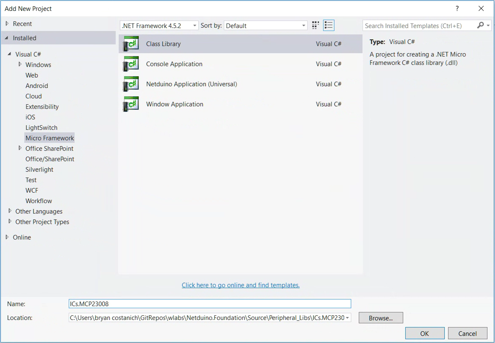
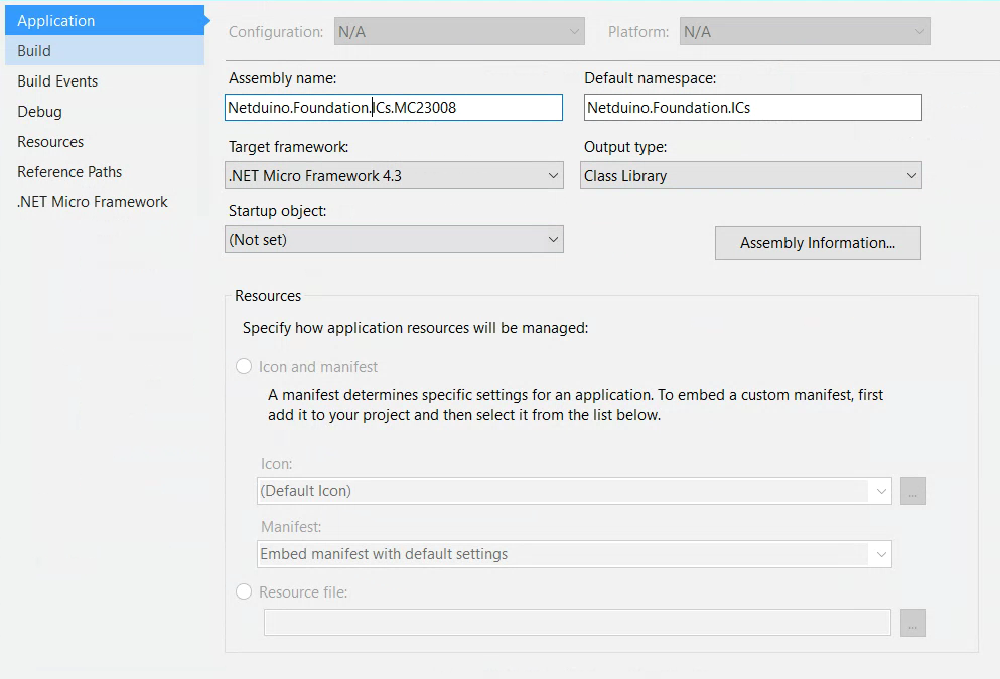

# Notes

Creating a new MCP23008 driver.

## Step 1 - Setup the Filesystem Directories

1. Create a new folder for the driver in the `Source/Peripheral_Libs` directory following the established convention. I.e: `ICs.MCP23008`.
2. In that folder create the following folders:
  * `Datasheet`
  * `Driver`
  * `Samples`
3. Add the datasheet for the peripheral to the `Datasheet` directory.

## Step 2 - Create the Visual Studio Solution Directory

1. Right-click on the solution file and choose **Add** > **New Solution Folder**.
2. Give the folder the same name as the folder in the file system, i.e: `ICs.MCP23008`.

## Step 3 - Create the Driver Project

1. Right-click on the newly created solution folder and choose **Add** > **New Project**.
2. Change the location of the project to be the `/driver` folder, i.e., `Source/Peripheral_Libs/ICs.MCP23008/Driver/`.
3. From the left nav template selector, choose: **Installed** > **Visual C#** > **Micro Framework**, and select **Class Library** as the project template type.
4. Name the project to match the folder, i.e.: `ICs.MCP23008`:
  

## Step 4 - Configure the Driver Project

Double-click on the project **Properties** file to open it, and make the following changes:

1. Change the assembly name to be the fully qualified driver name, such as `Netduino.Foundation.ICs.MCP23008`
2. Change the default namespace to be be the root namespace of driver category, such as `Netduino.Foundation.ICs`
3. Change the **Target Framework** to `.NET Micro Framework 4.3`.

When you're done, your project properties should look something like the following:

