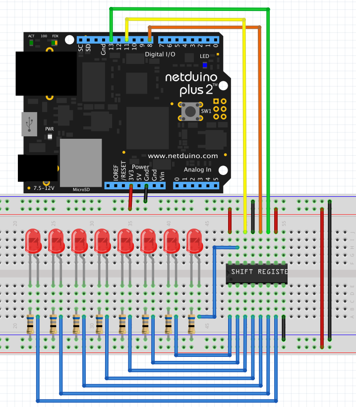

# Overview

Shift registers offer the ability to increase the number of outputs on a microcontroller by using I2C or SPI interfaces.  In the case of the 74xx595 series of shift registers, the SPI interface is used to output a series of bits that are then latched to the output pins of the chip.

This class allows the Netduino to control the output pins on a 74HCT595 shift register using the SPI interface.

Note that when using this chip care should be taken to make sure that the total output load of the chip does not exceed the current and thermal dissipation properties for the specific shift register being used.

## Unified GPIO Architecture

In addition to the low-level API, the Netduino.Foundation 74HCT595 driver conforms to the [unified GPIO architecture](/API/GPIO/), which enables it to be used with other Netduino.Foundation peripherals as if the ports on the shift register chip were part of the Netduino itself. For instance, you can connect an 74HCT595 chip to a Netduino, and then drive a Relay via one of the pins on the expansion chip, just as if it were connected directly to a digital pin on the Netduino:

```csharp
// create our x74595
x74595 shiftRegister = new x74595(8, config);

// create a digital output port from that mcp
DigitalOutputPort relayPort = shiftRegister.CreateOutputPort(0, false);

// create a new relay using that digital output port
Relay relay = new Relay(relayPort);

// toggle the relay
relay.Toggle();
```

## Hardware

The board below shows the Netduino connected to a shift register and 8 LEDs.  The binary value on the output pins of the shift register will be presented on the LEDs:



## Software

The application below uses a `ShiftRegister74595` object to cycle through the bits on the shift register and light the appropriate LED.

```csharp
using System.Threading;
using Microsoft.SPOT.Hardware;
using SecretLabs.NETMF.Hardware.Netduino;
using Netduino.Foundation.ICs.IOExpanders.x74595;
using Netduino.Foundation.Relays;
using Microsoft.SPOT;

namespace x74595_RelaySample
{
    public class Program
    {
        public static void Main()
        {
            var config = new SPI.Configuration(SPI_mod: SPI_Devices.SPI1,
                                               ChipSelect_Port: Pins.GPIO_PIN_D8,
                                               ChipSelect_ActiveState: false,
                                               ChipSelect_SetupTime: 0,
                                               ChipSelect_HoldTime: 0,
                                               Clock_IdleState: true,
                                               Clock_Edge: true,
                                               Clock_RateKHz: 10);

            var shiftRegister = new x74595(8, config);

            while (true)
            {
                shiftRegister.Clear(true);
                for (byte index = 0; index <= 7; index++)
                {
                    shiftRegister[index] = true;
                    shiftRegister.LatchData();
                    Thread.Sleep(500);
                    shiftRegister[index] = false;
                }
            }
        }
    }
}
```

The hardware and software configuration above can be seen running on the [Netduino YouTube channel](https://youtu.be/uLxth43EwIQ).

## API

### Constructors

#### `ShiftRegister74595(int bits, SPI.Configuration config)`

Create a new `ShiftRegister74595` object using the parameters in the `SPI.Configuration` object.  The `SPI.Configuration` object in the sample application above is correct for a 74xx595.

### Methods

#### `bool this[int bit]`

The index operator is overloaded to allow simple access to each of the bits in the shift register as follows:

```csharp
shiftRegister[index] = true;
```

#### `public DigitalOutputPort CreateOutputPort(byte pin, bool initialState)`

Creates a new `DigitalOutputPort` (which implements [`IDigitalOutputPort`](/API/GPIO/IDigitalOutputPort/)) using the specified pin and initial state.

This method allows you to use an output pin on the 74HC595 as if it were a digital output pin on the Netduino, via the [unified GPIO architecture](/API/GPIO/).

#### `public void WriteToPort(int pin, bool value)`

Sets a particular pin's value, either high/`3.3V` (`true`), or low/`0V` (`false`). This method automatically calls LatchData() to send the data to the SPI interface.

#### `void Clear(bool latch = false)`

Clear all of the bits in the shift register.  The optional `latch` parameter can be used to force the bits onto the output from the shift register.

#### `void LatchData()`

Latch the data onto the shift register outputs.