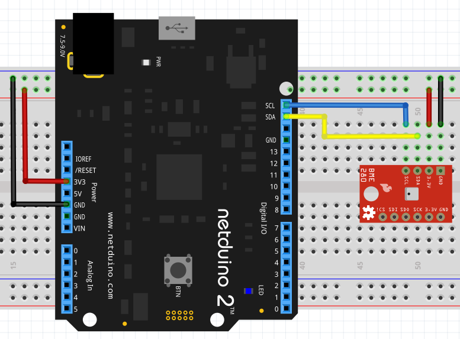

The BME280 is a combined temperature, pressure and humidity sensor.

## Purchasing

The BME280 sensor is available as a breakout board from the following suppliers:

* [SparkFun BME280](https://www.sparkfun.com/products/13676)
* [Adafruit BME280](https://www.adafruit.com/product/2652)

## Hardware

The BME280 can be connected using I2C or SPI.  Only 4 wires are required when using I2C:

* 3.3V
* Ground
* SDA
* SCL



It should be noted that the Sparkfun board is supplied with pull-up resistors enabled by default.  The Adafruit board does not have any pull-up resistors onboard.  It is therefore necessary to add two pull-up resistors (`4.7 K` should be adequate for a single device) between 3.3V and SDA and 3.3V and SCL.

## Software

The BME280 can operating in polling and interrupt mode.

### Polling Mode

In polling mode, it is the responsibility of the main application to check the sensor readings ona periodic basis.  The following application creates an instance of the `BME280` class using the I2C interface.  The temperature, pressure and humidity are read every second and the readings displayed using the debugger.

The sensor is put into polling mode by setting the `updateInterval` to `0` in the constructor.

```csharp
using Microsoft.SPOT;
using Netduino.Foundation.Sensors.Atmospheric;
using System.Threading;

namespace BME280PollingSample
{
    /// <summary>
    ///     Illustrate how to use the BME280 in polling mode.
    /// </summary>
    public class Program
    {
        public static void Main()
        {
            //
            //  Create a new BME280 object and put the sensor into polling
            //  mode (update intervale set to 0ms).
            //
            BME280 sensor = new BME280(updateInterval: 0);

            string message;
            while (true)
            {
                //
                //  Make the sensor take new readings.
                //
                sensor.Update();
                //
                //  Prepare a message for the user and output to the debug console.
                //
                message = "Temperature: " + sensor.Temperature.ToString("F1") + " C\n";
                message += "Humidity: " + sensor.Humidity.ToString("F1") + " %\n";
                message += "Pressure: " + (sensor.Pressure / 100).ToString("F0") + " hPa\n\n";
                Debug.Print(message);
                //
                //  Sleep for 1000ms before repeating the process.
                //
                Thread.Sleep(1000);
            }
        }
    }
}
```

### Interrupt Mode

When the driver is operating in interrupt mode, the driver will periodically check the sensor reading.  An interrupt will be generated if the difference between the last reported reading and the current reading is greater than a threshold value.

The sensor operates in interrupt mode by default.

The following application will generate interrupts when changes to any one of the temperature, humidity or pressure readings exceed their threshold values:

```csharp
using System;
using System.Threading;
using Microsoft.SPOT;
using Netduino.Foundation.Sensors.Atmospheric;
using Netduino.Foundation.Sensors;

namespace BME280InterruptSample
{
    /// <summary>
    ///     This sample illustrates how to use the interrupt (events) to obtain
    ///     temperature, humidity and pressures reading when the values change
    ///     outside of the specified thresholds.
    /// </summary>
    public class Program
    {
        public static void Main()
        {
            //
            //  BME280 temperature, humidity and pressure object.  This object should
            //  raise an interrupt when the changes in the sensor readings exceed the
            //  following:
            //
            //  Temperature: +/- 1 C
            //  Humidity: +/- 1 %
            //  Pressure: +/- 10 kPa (the default value for this threshold)
            //
            BME280 sensor = new BME280(temperatureChangeNotificationThreshold: 0.1F,
                humidityChangeNotificationThreshold: 1.0f);
            //
            //  Attach interrupt handlers to the temperature, humidity and pressure sensor.
            //
            sensor.HumidityChanged += (s, e) =>
            {
                Debug.Print("Current humidity: " + e.CurrentValue.ToString("f2"));
            };
            sensor.PressureChanged += (s, e) =>
            {
                Debug.Print("Current pressure: " + (e.CurrentValue / 100).ToString("f2"));
            };
            sensor.TemperatureChanged += (s, e) =>
            {
                Debug.Print("Current temperature: " + e.CurrentValue.ToString("f2"));
            };
            //
            //  Application can go to sleep now as readings will be dealt with by the
            //  interrupt handlers.
            //
            Thread.Sleep(Timeout.Infinite);
        }
    }
}
```

## API

### Constants

#### `const ushort MINIMUM_POLLING_PERIOD = 100`

Minimum value for the `updateInterval` property in the constructor.  This represents the minimum number of milliseconds between sensor samples when operating in interrupt mode.

### Enums

#### `Oversample`

Possible oversample rates (`Skip, 1, 2, 4, 8, or 16).

#### `Modes`

Operating modes, `Sleep`, `Forced` or `Normal`.

#### `StandbyDuration`

Possible values for the inactive duration when running in `Normal` mode.  Possible durations range from 0.5 ms to 20 ms.

#### `FilterCoefficient`

Possible values for the filter coefficient.

### Constructor

#### `BME280(byte address = 0x77, ushort speed = 100, ushort updateInterval = MINIMUM_POLLING_PERIOD, float humidityChangeNotificationThreshold = 0.001F, float temperatureChangeNotificationThreshold = 0.001F, float pressureChangedNotificationThreshold = 10.0F)`

The simplest constructor creates a new `BME280` object configured to use I2C with the default address of `0x77` and a default speed of `100` KHz.

Default values are set for the sensor properties:

* Mode is set to normal.
* Oversampling setting for temperature, pressure and humidity set to x1
* Filter is turned off.
* Standby period is set to 0.5 milliseconds.

In interrupt mode, the `updateInterval` defines the number of milliseconds between samples.  By default, this is set to the `MINIMUM_POLLING_PERIOD` and this places the sensor in interrupt mode.  Setting the `updateInterval` to 0 milliseconds places the sensor in polling mode.

`humidityChangeNotificationThreshold`, `temperatureChangeNotificationThreshold` and `pressureChangedNotificationThreshold` define the thresholds for the interrupts (events).  Any changes in the temperature, humidity and pressure readings that exceed the respective thresholds will generate the appropriate event.

### Properties

#### `float Temperature`

Temperature in &deg;C.

#### `float Pressure`

Air pressure in Pascals.

#### `float Humidity`

Relative humidity as a percentage.

#### `TemperatureOverSampling`

Set the temperature oversampling rate.

#### `PressureOversampling`

Set the pressure oversampling rate.

#### `HumidityOverSampling`

Set the humidity oversampling rate.

#### `Mode`

Set the sensor operating mode.

#### `Standby`

Set the inactive duration in normal mode.

#### `Filter`

Set the time constant for the IIR filter.

#### `Measuring`

Indicate if the sensor is making measurements.

#### `UpdatingMemory`

Indicates if the sensor is copying data into memory.

### Methods

#### `void Reset()`

Resets the sensor and reads the compensation data.

#### `void Update()`

Update the current temperature, pressure and humidity readings.

In polling mode, this method must be called before accessing the `Temperature`, `Pressure` or `Humidity` properties.  This method does not need to be called in interrupt mode.

#### `void UpdateConfiguration()`

This method should be called when one or more of the following properties are modified:

* `TemperatureOverSampling`
* `PressureOversampling`
* `HumidityOverSampling`
* `Mode`
* `Standby`
* `Filter`

Setting any of the above properties without calling `UpdateConfiguration` will not change the operation of the sensor.  Calling `UpdateConfiguration` will cause the properties in the sensor to be updated and so the method of operation of the sensor will also change.

### Events

#### `event SensorFloatEventHandler TemperatureChanged`

A `TemperatureChanged` event is raised when the difference between the current and last temperature readings exceed +/- `temperatureChangeNotificationThreshold`.

#### `event SensorFloatEventHandler HumidityChanged`

A `HumidityChanged` event is raised when the difference between the current and last humidity readings exceed +/- `humidityChangeNotificationThreshold`.

#### `event SensorFloatEventHandler PressureChanged`

A `PressureChanged` event is raised when the difference between the current and last pressure readings exceed +/- `pressureChangedNotificationThreshold`.