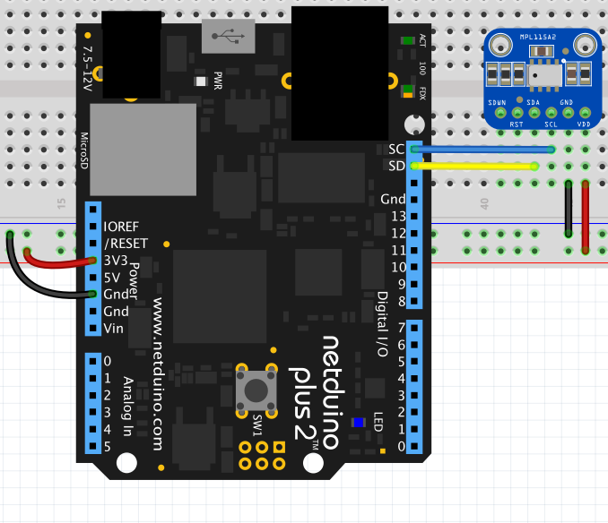

The MPL115A2 is a low cost device for reading barometric pressure.

* I2C digital interface (address: `0x60`)
* Resolution: 1.5 hPa
* Range: 100-1150 hPa up to 10Km

## Purchasing

The MPL115A2 sensor is available on a breakout board from Adafruit

* [Adafruit MPL115A2 Breakout Board](https://www.adafruit.com/product/992)

## Hardware

The simplest method of connecting the MPL115A2 to the Netduino requires only four connections:



In this diagram, the shutdown (`SDWN`) and reset (`RST`) pins have been left floating.  Both of these pins are active low and can be tied to V<sub>cc</sub> in normal operation.

Note that the Adafruit breakout board has `10K` pull-up resistors on the `SDA` and `SCK` lines.

## Software

The MPL115A2 can operate is a polling or interrupt mode.  The default operation is interrupt mode.

### Interrupt Mode

The application below connects the MPL115A2 to two interrupt handlers.  These interrupt handlers (events) will display the `Temperature` and `Pressure` properties when the handlers are triggered.  The sensor is checked every 500 milliseconds.

```csharp
using System.Threading;
using Microsoft.SPOT;
using Netduino.Foundation.Sensors.Barometric;

namespace MPL115A2InterruptSample
{
    /// <summary>
    ///     This application illustrates how to use the interrupt (event)
    ///     handlers in the MPL115A2 sensor to obtain temperature and pressure
    ///     readings.
    /// </summary>
    public class Program
    {
        public static void Main()
        {
            //
            //  Create a new MPL object and set the temperature change threshold to 0.1C
            //  and leave the pressure threshold set to the default 10 kPa.  Have the
            //  sensor check the current readings every 0.5 seconds (500 milliseconds)
            //
            var mpl115a2 = new MPL115A2(updateInterval: 500, temperatureChangeNotificationThreshold: 0.1F);

            Debug.Print("MPL115A2 Interrupt Example");
            //
            //  Attach interrupt handlers to the temperature and pressure sensor.
            //
            mpl115a2.PressureChanged += (s, e) =>
            {
                Debug.Print("Pressure: " + e.CurrentValue.ToString("f2"));
            };

            mpl115a2.TemperatureChanged += (s, e) =>
            {
                Debug.Print("Temperature: " + e.CurrentValue.ToString("f2") + "C");
            };
            //
            //  Application can go to sleep now as readings will be dealt with by the 
            //  interrupt handlers.
            //
            Thread.Sleep(Timeout.Infinite);
        }
    }
}
```

### Polling Mode

The following application reads the `Temperature` and `Pressure` from the MPL115A2 every second and displays the readings in the `Debug` output:

```csharp
using System.Threading;
using Microsoft.SPOT;
using Netduino.Foundation.Sensors.Barometric;

namespace MPL115A2PollingSample
{
    /// <summary>
    ///     This application illustrates how to use the MPL115A2 temperature and
    ///     pressure in polling mode.  It is the responsibility of the application
    ///     to check the sensor readings as required.
    /// </summary>
    public class Program
    {
        public static void Main()
        {
            //
            //  Create a new MPL115A2 sensor object and set to polling mode
            //  i.e. update period is 0 milliseconds.
            //
            var mpl115a2 = new MPL115A2(updateInterval: 0);

            Debug.Print("MPL115A2 Polling Example");
            while (true)
            {
                //
                //  Have the sensor make new readings.
                //
                mpl115a2.Update();
                //
                //  Display the values in the debug console.
                //
                Debug.Print("Pressure: " + mpl115a2.Pressure.ToString("f2") + " kPa, Temperature: " +
                            mpl115a2.Temperature.ToString("f2") + "C");
                //
                //  Sleep for a while (1 second) before taking the next readins.
                //
                Thread.Sleep(1000);
            }
        }
    }
}
```

## API

This API supports a polling and interrupt method of reading the sensor.  In polling mode, the `Update` method forces the sensor to take new readings and then record the readings in the `Temperature` and `Pressure` properties.

### Constants

#### `const ushort MinimumPollingPeriod = 100`

Minimum value for the `updateInterval` property in the constructor.  This represents the minimum number of milliseconds between sensor samples when operating in interrupt mode.

### Constructor

#### `MPL115A2(byte address = 0x60, ushort speed = 100, ushort updateInterval = MinimumPollingPeriod, float temperatureChangeNotificationThreshold = 0.001F, float pressureChangedNotificationThreshold = 10.0F)`

Create a new `MPL115A2` object.

In interrupt mode, the `updateInterval` defines the number of milliseconds between samples.  By default, this is set to the `MinimumPollingPeriod` and this places the sensor in interrupt mode.  Setting the `updateInterval` to 0 milliseconds places the sensor in polling mode.

`temperatureChangeNotificationThreshold` and `pressureChangedNotificationThreshold` define the thresholds for the interrupts (events).  Any changes in the temperature, humidity and pressure readings that exceed the respective thresholds will generate the appropriate event.

### Properties

#### `float Temperature`

Retrieve the last read temperature.  In polling mode, the `Temperature` property is only valid after a call to `Update`.  In interrupt mode the `Temperature` property will be updated periodically.

#### `public float TemperatureChangeNotificationThreshold { get; set; } = 0.001F`

Threshold for the `TemperatureChanged` event.  Differences between the last notified value and the current value which exceed + / - `TemperateChangedNotificationThreshold` will generate an interrupt.

#### `float Pressure`

Retrieve the last read pressure in Pascals.  In polling mode, the `Pressure` property is only valid after a call to `Update`.  In interrupt mode the `Pressure` property will be updated periodically.

#### `public float PressureChangeNotificationThreshold { get; set; } = 0.001F`

Threshold for the `PressureChanged` event.  Differences between the last notified value and the current value which exceed + / - `PressureChangedNotificationThreshold` will generate an interrupt.

### Methods

#### `void Update()`

Force the sensor to take a reading and record the readings in the `Pressure` and `Temperature` properties.

### Events

#### `event SensorFloatEventHandler TemperatureChanged`

A `TemperatureChanged` event is raised when the difference between the current and last temperature readings exceed +/- `temperatureChangeNotificationThreshold`.  The event will return the last reading and the current reading (see [`SensorFloatEventArgs`](/API/Sensors/SensorFloatEventArgs)).

#### `event SensorFloatEventHandler PressureChanged`

A `PressureChanged` event is raised when the difference between the current and last pressure readings exceed +/- `pressureChangedNotificationThreshold`.  The event will return the last reading and the current reading (see [`SensorFloatEventArgs`](/API/Sensors/SensorFloatEventArgs)).