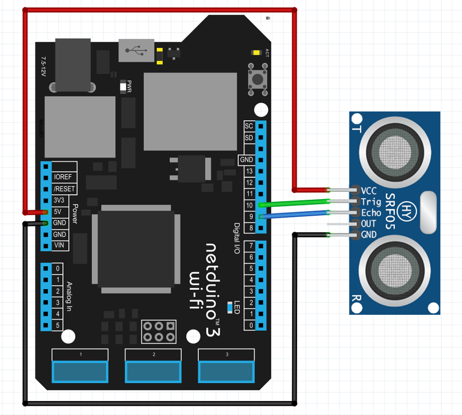

# HYSRF05

The HY-SRF05 ultrasonic sensor uses sonar to determine distance to an object (like bats). It offers excellent non-contact range detection with high accuracy and stable readings in an easy-to-use package.

## Purchasing

The HYSRF05 sensor is available from Sparkfun:

* [Ultrasonic Sensor - HY-SRF05](https://www.banggood.com/5Pcs-HY-SRF05-Ultrasonic-Distance-Sensor-Module-Measuring-Sensor-Module-p-1052102.html?gmcCountry=CA&currency=CAD&createTmp=1&utm_source=googleshopping&utm_medium=cpc_elc&utm_content=frank&utm_campaign=pla-mix-ca-pc-0630&gclid=CjwKCAiAjNjgBRAgEiwAGLlf2gWlxvQ8KUuy24vjU37IDVTcLQTqFRpcEy3KyXbeOhK8cPH2UP9SjRoCIdYQAvD_BwE&cur_warehouse=CN)

## Hardware

The HYSRF05 sensor has 5 pins, but you'll only connect 4: power, ground, echo and trigger (out isn't used).



## Software

The following application creates a `HYSRF05` object, invokes `MeasureDistanceSensor` every second and attaches interrupt handlers to the `DistanceDetected` event that its triggered when the sensor picks up a rebound signal:

```csharp
using Microsoft.SPOT;
using System.Threading;
using Netduino.Foundation.Sensors.Distance;
using SecretLabs.NETMF.Hardware.Netduino;

namespace HYSRF05Test
{
    public class Program
    {
        public static void Main()
        {
            var  _HYSRF05 = new HYSRF05(Pins.GPIO_PIN_D12, Pins.GPIO_PIN_D11);
            _HYSRF05.DistanceDetected += OnDistanceDetected;

            while (true)
            {
                _HYSRF05.MeasureDistance();
                Thread.Sleep(1000);
            }
        }

        private static void OnDistanceDetected(object sender, DistanceEventArgs e) 
        {
            Debug.Print(e.Distance.ToString());
        }
    }
}
```

## API

### Constructors

#### `HYSRF05(Cpu.Pin triggerPin, Cpu.Pin echoPin)`

Create a new `HYSRF05` object with the sensor connected to the trigger `OutputPort` and echo `interruptPort`.

### Properties

#### `public float CurrentDistance { get; private set; }`

Returns the distance after calling `MeasureDistance` method

### Methods

#### `public void MeasureDistance()`

Makes the HYSRF05 sensor to send a ultrasonic distance, and if detects a rebound signal, it will fire the `DistanceDetected` event.

### Events

#### `public event DistanceDetectedEventHandler DistanceDetected`

The event is raised when the sensor picks up an obstacle within its maximum distance range.