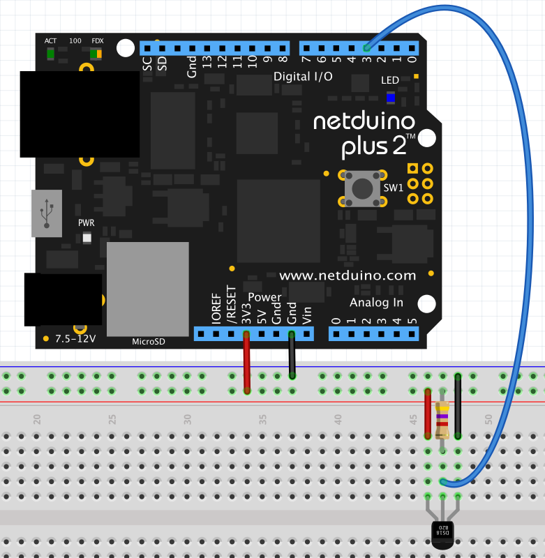
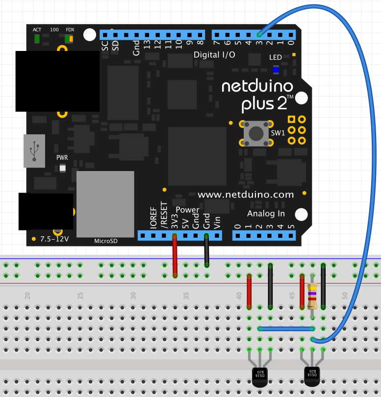

The DS18B20 is a 1-Wire temperature sensor manufactured by Maxim.  The sensor can operate in 9, 10, 11 or 12 bit precision and has a range of -55&deg;C to 125 &deg;C.

Each sensor has a 64-bit unique identifier built in.  This allows multiple sensors to be connected to the same 1-Wire bus.  So for instance, a project could measure internal and external temperature using a single GPIO pin.

# Purchasing

DS18B20 sensors are available in TO-92 packaging and also in a waterproof version from the following suppliers:

* [Adafruit DS18B20 TO-92 Package with Pull-up Resistor](https://www.adafruit.com/product/374)
* [Adafruit Waterproof DS18B20](https://www.adafruit.com/product/381)
* [Sparkfun DS18B20 TO-92 Package](https://www.sparkfun.com/products/245)
* [Sparkfun Waterproof DS18B20](https://www.sparkfun.com/products/11050)

Note that when purchasing a DS18B20 you will require a 4K7 pull-up resistor if one is not already supplied with the sensor.

## Hardware

As noted above, multiple devices can be connected to a Netduino and the following combinations are possible:

1. Single DS18B20
2. Multiple DS18B20 sensors connected to a single pin
3. Multiple DS18B20 sensors connected to multiple pins

This driver has been written to allow for all of these options in single and multi-threaded environments.

### Single DS18B20

The following diagram shows how to connect a single DS18B20 to a Netduino:



### Multiple DS18B20 Temperature Sensors

Multiple DS18B20 temperature sensors can also be connected to the same GPIO pin on the Netduino:



## Software

The driver for the DS18B20 temperature sensor can operate in interrupt or polling mode.

### Interrupt Mode

The example below will check the temperature every second.  An interrupt will be raised if the difference in temperature between the last reported reading and the current reading is greater than + / - 0.5 &deg;C.

```csharp
using System.Threading;
using Microsoft.SPOT;
using SecretLabs.NETMF.Hardware.NetduinoPlus;
using Netduino.Foundation.Sensors.Temperature;

namespace DS18B20_InterruptSample
{
    /// <summary>
    ///     This application illustrates how to deal with events from a DS18B20 temperature
    ///     sensor.
    ///
    ///     The application uses event to capture the temperature changes by +/- 0.5 C (or more)
    ///     and then displays the current temperature in the Debug output.
    /// </summary>
    /// <remarks>
    ///     Connect a single DS18B20 temperature sensor to a Netduino 3 Ethernet or Netduino 3 WiFi using
    ///     GPIO pin D3.
    ///
    ///     Note that the sensor ID is not required when only one OneWire device is connected
    ///     to a single digital pin.
    /// </remarks>
    public class Program
    {
        /// <summary>
        ///     Main program sets things up and then goes to sleep.
        /// </summary>
        public static void Main()
        {
            DS18B20 ds18B20 = new DS18B20(Pins.GPIO_PIN_D3, updateInterval: 1000, temperatureChangeNotificationThreshold: 0.5F);
            ds18B20.TemperatureChanged += ds18b20_TemperatureChanged;
            Thread.Sleep(Timeout.Infinite);
        }

        /// <summary>
        ///     Temperature of ds18b20 has changed by more than 0.001 C
        /// </summary>
        private static void ds18b20_TemperatureChanged(object sender, Netduino.Foundation.Sensors.SensorFloatEventArgs e)
        {
            Debug.Print("Temperature: " + ((DS18B20) sender).Temperature.ToString("F2"));
        }
    }
}
```

### Polling Mode

The following application reads the temperature from the DS18B20 sensor every 0.5 seconds and displays the results in the debug console:

```csharp
using System.Threading;
using Microsoft.SPOT;
using SecretLabs.NETMF.Hardware.NetduinoPlus;
using Netduino.Foundation.Sensors.Temperature;

namespace DS18B20_PollingSample
{
    public class Program
    {
        /// <summary>
        ///     This application demonstrates how to create a new DS18B20 object and read
        ///     the temperature from the sensor.  The current temperature will be displayed
        ///     in the Debug Output window every 500-1250ms.
        ///
        ///     Note that the rate of display is dependent upon the time it take to perform
        ///     the conversion of the temperature into a digital value.
        ///
        ///     Connect the DS18B20 data pin to GPIO D3 and then apply power and ground to
        ///     the sensor.
        /// </summary>
        public static void Main()
        {
            DS18B20 ds18b20 = new DS18B20(Pins.GPIO_PIN_D3, updateInterval: 0);
            while (true)
            {
                ds18b20.Update();
                Debug.Print("Current temperature: " + ds18b20.Temperature);
                Thread.Sleep(500);
            }
        }
    }
}
```

### Obtaining the ROM ID

The two samples above both use a single DS18B20 connected to a single GPIO pin.  The  multiple sensors on a single pin is a little more complex as the driver needs to understand which sensor is being addressed.

Each sensor has a unique 64-bit ID cut into the package.  This can be interrogated and used to differentiate between two or more sensors.

The application below will read the ROM ID from a DS18B20.  This can only be done when a single DS18B20 is attached to the Netduino:

```csharp
using System.Threading;
using Microsoft.SPOT;
using SecretLabs.NETMF.Hardware.NetduinoPlus;
using Netduino.Foundation.Sensors.Temperature;

namespace DS18B20_ReadConfiguration
{
    public class Program
    {
        /// <summary>
        ///     Read the configuration and ID from the DS18B20 and display the information
        ///     retrieved in the Debug Output window.
        ///
        ///     Note that this sample will only work if there is only one device on the
        ///     one wire bus.
        ///
        ///     Connect the DS18B20 temperature sensor to GPIO D3.
        /// </summary>
        public static void Main()
        {
            DS18B20 ds18b20 = new DS18B20(Pins.GPIO_PIN_D3, updateInterval: 0);
            ds18b20.ReadDeviceID();
            Debug.Print("Device ID: 0x" + ds18b20.DeviceID.ToString("X16"));
            Debug.Print("Resolution: " + ds18b20.Resolution + " bits");
            Thread.Sleep(Timeout.Infinite);
        }
    }
}
```

### Multiple Sensors on a Single GPIO Pin

The following application illustrates how to use two DS18B20 senors connected to a single pin using interrupt mode to display the temperature changes:

```csharp
using System.Threading;
using Microsoft.SPOT;
using SecretLabs.NETMF.Hardware.NetduinoPlus;
using Netduino.Foundation.Sensors.Temperature;

namespace DS18B20_MultipleSensors
{
    /// <summary>
    ///     This application illustrates how to deal with events from multiple DS18B20 temperature
    ///     that are connected to the same digital output pin.
    ///
    ///     The application uses event to capture the temperature changes and then displays the
    ///     current temperature in the Debug output.
    /// </summary>
    /// <remarks>
    ///     Connect two DS18B20 temperature sensors to a Netduino 3 Ethernet or Netduino 3 WiFi using
    ///     GPIO pin D3.
    ///
    ///     Change the sensor ID in the two lines constructing the sensor1 and sensor2 objects in the
    ///     code below.  Note that you can obtain the sensor ID numbers using the DS18B20_ReadConfiguration
    ///     sample.
    /// </remarks>
    public class Program
    {
        /// <summary>
        ///     Main program sets things up and then goes to sleep.
        /// </summary>
        public static void Main()
        {
            DS18B20 sensor1 = new DS18B20(Pins.GPIO_PIN_D3, 0x75000006DE7FE728, 1000);
            sensor1.TemperatureChanged += Sensor1_TemperatureChanged;
            DS18B20 sensor2 = new DS18B20(Pins.GPIO_PIN_D3, 0x64000006DCA35528, 1000, 0.5F);
            sensor2.TemperatureChanged += Sensor2_TemperatureChanged;
            Thread.Sleep(Timeout.Infinite);
        }

        /// <summary>
        ///     Temperature of sensor 1 has changed by more than 0.001 C
        /// </summary>
        private static void Sensor1_TemperatureChanged(object sender, Netduino.Foundation.Sensors.SensorFloatEventArgs e)
        {
            Debug.Print("Sensor1 temperature: " + ((DS18B20) sender).Temperature.ToString("F2"));
        }

        /// <summary>
        ///     Temperature of sensor 2 has changed by over 0.5 C
        /// </summary>
        private static void Sensor2_TemperatureChanged(object sender, Netduino.Foundation.Sensors.SensorFloatEventArgs e)
        {
            Debug.Print("Sensor2 temperature: " + ((DS18B20) sender).Temperature.ToString("F2"));
        }
    }
}
```

The important point to note is the use of the ROM ID in the constructor for the `DS18B20` objects.

## API

This API supports a polling and interrupt method of reading the sensor.  In polling mode, the `Update` method forces the sensor to take a new reading and then record the current temperature in the `Temperature` property.

### Constants

#### `const ushort MinimumPollingPeriod = 100`

Minimum value for the `updateInterval` property in the constructor.  This represents the minimum number of milliseconds between sensor samples when operating in interrupt mode.

### Enums

#### `public enum BusModeType`

`BusModeType` defines two values which can be used to determine if there is one (`SingleDevice`) or more (`MultipleDevices`) connected to the 1-Wire bus.

### Constructors

#### `public public DS18B20(Cpu.Pin oneWirePin, UInt64 deviceID = 0, ushort updateInterval = MinimumPollingPeriod, float temperatureChangeNotificationThreshold = 0.001F)`

Creates a new DS18B20 object where the sensor is connected to the specified `oneWirePin`.

The `deviceID` parameter is options for circuits containing one DS18B20 sensor on each GPIO pin.  The `deviceID` must be specified when multiple 1-Wire devices are connected to a single pin.

`updatePeriod` determines the operating mode of the driver.  An `updatePeriod` of `0` puts the device into polling mode.  In this mode the application is responsible for calling the `Update` method prior to accessing the `Temperature` property.  Non-zero values for the `updatePeriod` will cause the temperature to be checked periodically and an event raised should the change in temperature be outside the `temperatureChangeNotificationThreshold` parameter.

### Properties

#### `float Temperature`

Retrieve the last read temperature.  In polling mode, the `Temperature` property is only valid after a call to `Update`.  In interrupt mode the `Temperature` property will be updated periodically.

#### `public float TemperatureChangeNotificationThreshold`

Threshold for the `TemperatureChanged` event.  Differences between the last notified value and the current value which exceed + / - `TemperateChangedNotificationThreshold` will generate an interrupt.

Default value for this property is `0.001F` &deg;C.

#### `public int Resolution`

Current resolution of the sensor.  This sensor can operate in 9, 10, 11 or 12 bit mode.

#### `public ushort MaximumConversionPeriod`

Maximum conversion time for the DS18B20 based upon the current resolution.

#### `public UInt64 DeviceID`

`DeviceID` is used to identify the sensor being used when more than one sensor is attached to the 1-Wire bus.

### Methods

#### `void Update()`

Force the sensor to take a reading and record the readings in the `Temperature` property.

#### `void ReadDeviceID()`

`ReadDeviceID` will read the ID etched into the sensor.  This method will only work when a single device is connected to a GPIO pin.

#### `void ReadConfiguration()`

Read the current configuration from the DS18B20 device.

At the moment the DS18B20 only supports the resolution being stored in the configuration of the device.

### Events

#### `event SensorFloatEventHandler TemperatureChanged`

A `TemperatureChanged` event is raised when the difference between the current and last temperature readings exceed +/- `temperatureChangeNotificationThreshold`.  The event will return the last reading and the current reading (see [`SensorFloatEventArgs`](/API/Sensors/SensorFloatEventArgs)).